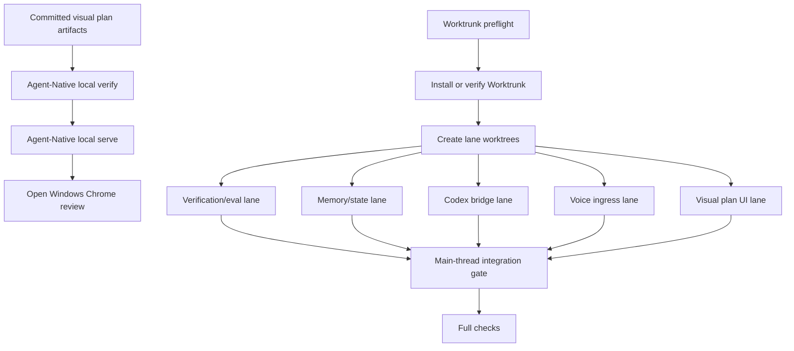
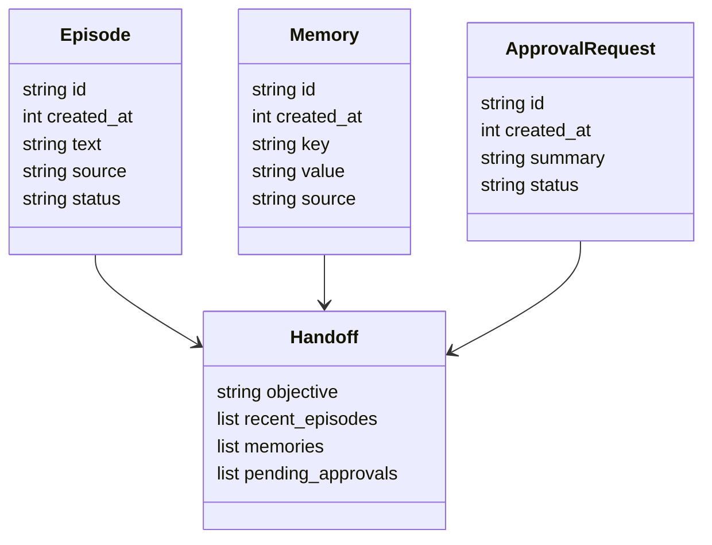
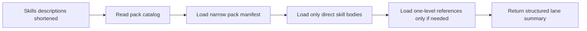

# Jarvis Codex Swarm Canvas

## Task Graph

## File Ownership

| Area | Current files | Likely lane owner |
| --- | --- | --- |
| CLI commands | `src/jarvis_codex/cli.py` | voice-ingress, codex-bridge, verification-eval |
| State model | `src/jarvis_codex/state.py` | memory-state, codex-bridge |
| Tests | `tests/test_state.py`, future smoke tests | verification-eval |
| Product docs | `README.md`, `docs/VISION.md`, `docs/HARNESS.md` | visual-plan-ui, codex-bridge |
| Runtime state placeholders | `state/**/.gitkeep` | verification-eval |
| Visual plan | `plans/jarvis-codex-swarm/*.mdx` | visual-plan-ui |

## Data Contracts

## Integration Gate

The main thread owns merges and final verification. Lane workers may edit only their assigned worktree, must not push or merge, and must not delete worktrees or branches. Any lane that needs to cross ownership boundaries must report the dependency rather than editing across the boundary.

## Context Budget Gate

Use partitioned lane worktrees to keep detailed context isolated. The coordinator should aggregate only structured worker outputs: lane, path, files inspected, files changed, verification, risks, and merge recommendation.
