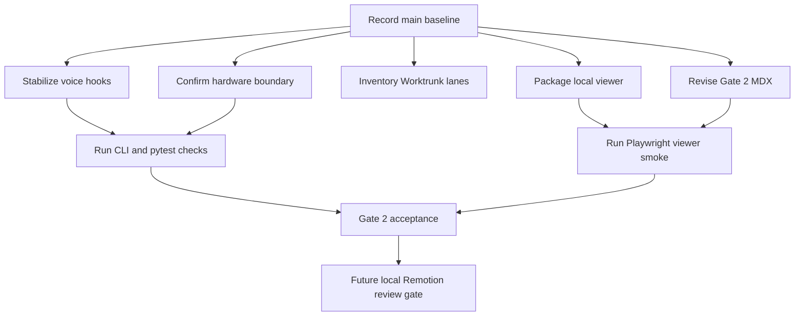
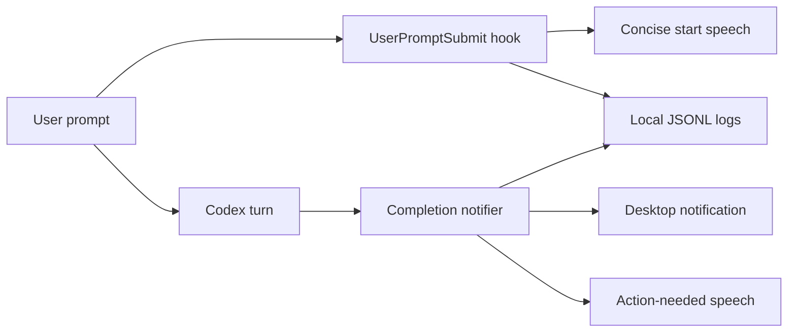
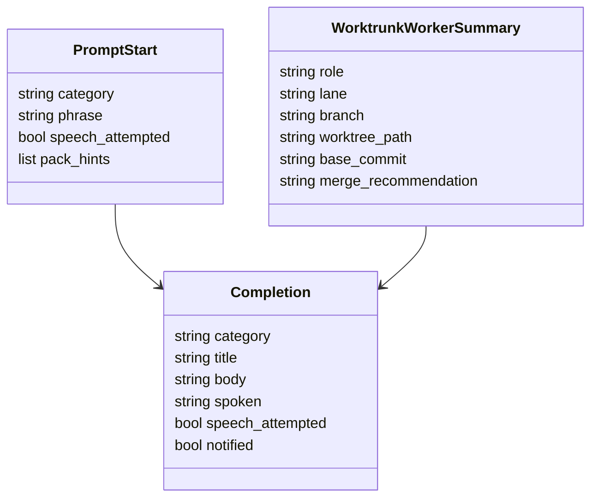

# Jarvis Codex Gate 2 Canvas

## Task Graph

## File Ownership

| Area | Current files | Gate 2 owner |
| --- | --- | --- |
| Packaged viewer | `src/jarvis_codex/plan_viewer.py`, `pyproject.toml` | Main-thread integration |
| Visual plan | `plans/jarvis-codex-swarm/*.mdx` | Main-thread integration |
| Notification hooks | `~/.codex/hooks/user_prompt_submit.py`, `~/.codex/bin/codex_notify_jarvis.py` | Local AI OS hooks |
| Runtime state placeholders | `state/**/.gitkeep` | Verification gate |
| Hardware boundary | `src/jarvis_codex/hardware.py`, `src/jarvis_codex/cli.py` | Verification gate |
| Worktrunk lanes | sibling `jarvis-codex.lane-*` worktrees | Human-approved Worktrunk operation |

## Runtime Boundaries

## Data Contracts

## Integration Gate

The main thread owns final integration and verification. Lane worktrees are inventory only in Gate 2 unless the user explicitly approves refresh, rebase, branch deletion, merge, push, hook edits, shell integration, or worktree removal.

## Local Viewer Gate

The viewer must run from the installed script, bind to `127.0.0.1`, serve files from `plans/jarvis-codex-swarm`, render Mermaid code fences as diagrams, and show no raw `flowchart` or `classDiagram` blocks in the rendered document body.
