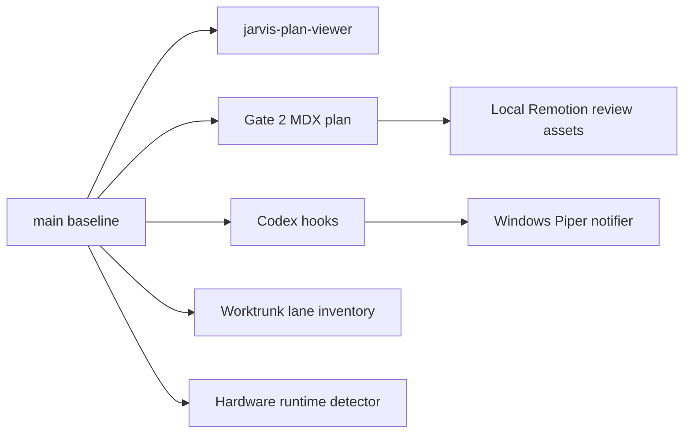

# Jarvis Codex Gate 2 Stabilization

## Intent

Reconcile the baseline before new feature work. `main` is the authoritative branch for this gate, the packaged `jarvis-plan-viewer` is the canonical local MDX/Mermaid review surface, and the old lane plan is revised in place instead of published to any hosted Agent-Native path.

## Source Of Truth

- Repository: `https://github.com/cyIVER/jarvis-codex.git`
- Base branch: `main`
- Gate focus: baseline reconciliation, local viewer packaging, Worktrunk lane planning, hardware/runtime boundary clarity, concise voice notifications, project-local Codex governance, and local Remotion review assets.
- Runtime state policy: commit only `.gitkeep` placeholders under `state/`; never commit generated JSON, JSONL, markdown handoffs, `.plan-url`, or local server artifacts.
- Voice policy: use short local Piper phrases through the existing Windows `notify.ps1` / `say.ps1` backend. Do not clone fictional voices or narrate routine successes by default.
- Remotion policy: local-only review asset scaffold is committed under `video/remotion`; generated outputs remain ignored and runtime commands remain approval-gated.

## Architecture



## Gate 2 Workstreams

| Workstream | Ownership | Gate 2 outcome |
| --- | --- | --- |
| Baseline reconciliation | Main thread | Treat `main` as authoritative, keep user work intact, record current worktree state, and avoid destructive cleanup without approval. |
| Local viewer | `src/jarvis_codex/plan_viewer.py`, `pyproject.toml` | Package `jarvis-plan-viewer`, serve only local `.mdx` files from `127.0.0.1`, render Mermaid blocks as diagrams, and verify with Playwright. |
| Visual plan | `plans/jarvis-codex-swarm/*.mdx` | Revise the existing plan in place for Gate 2 acceptance and remove hosted publish assumptions. |
| Worktrunk lanes | `src/jarvis_codex/lanes.py`, `docs/WORKTRUNK_LANES.md` | Read-only lane inventory and WorkerContract planning records; keep branch creation, deletion, merge, push, shell integration, and hooks gated. |
| Voice notifications | `~/.codex/hooks/user_prompt_submit.py`, `~/.codex/bin/codex_notify_jarvis.py` | Speak at prompt start by task type; speak on completion only for action-needed events by default. |
| Hardware/runtime | `jarvis-codex hardware` | Preserve local GPU/NPU/Docker detection as a recommendation boundary, not an autonomous execution path. |
| Codex governance | `.codex/`, `.agents/skills/`, `scripts/validate-jarvis-codex-phase1.py` | Keep project-local governance read-only, validated, and visible through `doctor --governance`. |
| Remotion review assets | `video/remotion/` | Local-only animated review scaffold with ignored render outputs and approval-gated runtime commands. |

## Worktrunk Lane Reconciliation

Current execution truth comes from `git worktree list`. At the time of lane reconciliation, only the main worktree was registered. Historical sibling lane names remain planning history until reconfirmed:

| Lane | Branch | Status rule |
| --- | --- | --- |
| Main | `main` | Current registered worktree. |
| Codex bridge | `lane/codex-bridge` | Historical planning lane; recreate, refresh, or abandon only after approval. |
| Memory/state | `lane/memory-state` | Historical planning lane; recreate, refresh, or abandon only after approval. |
| Verification/eval | `lane/verification-eval` | Historical planning lane; recreate, refresh, or abandon only after approval. |
| Visual plan UI | `lane/visual-plan-ui` | Historical planning lane; superseded by packaged viewer on `main`. |
| Voice ingress | `lane/voice-ingress` | Historical planning lane; hook integration remains separately gated. |

Lane workers must use this contract:

```yaml
role:
lane:
branch:
worktree_path:
base_commit:
task_summary:
files_inspected:
files_changed:
commands_run:
verification_performed:
findings:
integration_notes:
risks_or_blockers:
merge_recommendation: merge | hold | abandon | needs-human-decision
next_action:
```

Workers must not push, merge, rebase, delete branches, remove worktrees, edit hooks, configure shell integration, or launch Docker/GPU execution unless the main thread gets explicit approval for that specific action.

## Voice Notification Policy

Prompt start speech is enabled by default with `CODEX_NOTIFY_SPEAK_START=true`.

| Prompt category | Phrase |
| --- | --- |
| Planning | Planning pass started. |
| UI/browser | Reviewing the interface. |
| Agent swarm | Swarm coordination started. |
| Worktrunk | Worktree operation queued. |
| Hardware/ML | Checking local acceleration. |
| GitHub | Checking the GitHub workflow. |
| Coding | Code change pass started. |
| General | I'm on it. |

Completion speech defaults to `CODEX_NOTIFY_SPEAK_COMPLETIONS=action-needed`. Routine successful completions may still produce a desktop notification when the duration threshold is met, but speech is reserved for:

- Error: `The task needs attention.`
- Approval wait: `Approval is needed.`
- Blocked: `I'm blocked and need input.`
- User action needed: `Input is needed.`

`CODEX_NOTIFY_THRESHOLD_SECONDS=0` remains an override, not the default, because speaking every routine completion is noisy.

## Acceptance Checks

- `git status --short --branch` records the baseline and shows only intentional Gate 2 changes.
- `git worktree list` records current lane worktrees.
- `git ls-files state` confirms only `.gitkeep` runtime placeholders are tracked.
- `uv run pytest` passes.
- `uv run jarvis-codex --state /tmp/jarvis-codex-state doctor --governance` succeeds without creating that state directory.
- `uv run jarvis-codex hardware --workload video` succeeds.
- `python3 scripts/validate-jarvis-codex-phase1.py` reports `PASS`.
- `jarvis-plan-viewer` starts on `127.0.0.1` and Playwright confirms tabs, diagrams, no console errors, no raw Mermaid leaks, and no horizontal overflow.
- `npm run typecheck`, `npm audit --audit-level=high`, `npm run still`, and `npm run render` pass inside `video/remotion`.
- `python3 ~/.codex/bin/codex_notify_jarvis.py --test` completes and logs category/speech decisions.
- Simulated prompt-submit payloads select planning, UI/browser, swarm, Worktrunk, hardware, GitHub, coding, and general start phrases.
- Simulated completion payloads select success, failure, blocked, approval-needed, and user-action-needed behavior.

## Open Risks

- Actual audible speech depends on the Windows Piper scripts being reachable from WSL.
- Worktrunk lane refresh is intentionally gated because it can rebase branches or mutate worktrees.
- Docker/GPU execution remains a recommendation and approval boundary, not an automatic action.
- Remotion runtime commands are local-only but still write generated assets and may download browser dependencies; keep them explicit and approval-gated.
