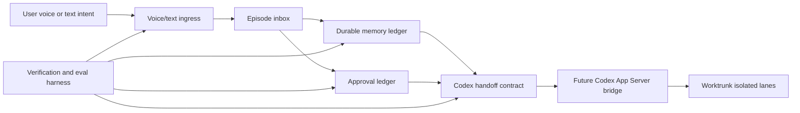

# Jarvis Codex Visual-Planning Swarm

## Intent

Build the next phase of `cyIVER/jarvis-codex` with five isolated Worktrunk lanes and a local-first Agent-Native review surface. The implementation keeps Jarvis Codex small, filesystem-backed, approval-aware, and ready for future Codex App Server and desktop voice integrations.

## Source Of Truth

- Repository: `https://github.com/cyIVER/jarvis-codex.git`
- Base branch: `main`
- Current product: Python CLI with episode capture, durable memory, approval requests, handoff generation, and `doctor`.
- Runtime state policy: commit only `.gitkeep` placeholders under `state/`; never commit generated JSON, JSONL, or markdown handoffs.
- Voice policy: build a licensed/local assistant voice style; exact fictional JARVIS or Iron Man voice cloning is out of scope.

## Architecture

## Lane Map

| Lane | Branch | Ownership | Deliverable |
| --- | --- | --- | --- |
| Verification/eval | `lane/verification-eval` | Tests, smoke scripts, acceptance checklist, fixture safety | Harness that proves CLI and state behavior before other lane merges |
| Memory/state | `lane/memory-state` | Memory schema, episode lifecycle, import/export, cleanup invariants | Durable state contracts that stay debuggable and local-first |
| Codex bridge | `lane/codex-bridge` | Handoff contracts, approval ledger, app-server adapter stubs | Clear execution boundary without uncontrolled tool execution |
| Voice ingress | `lane/voice-ingress` | Text/speech capture interfaces, hotkey/desktop intake design | Adapter boundary for future speech and desktop entrypoints |
| Visual plan UI | `lane/visual-plan-ui` | MDX plan files, local serve workflow, Chrome launch helper docs/scripts | Review surface and repeatable local-plan workflow |

## Execution Workflow

1. Verify the visual plan locally with Agent-Native.
2. Install and verify Worktrunk using Cargo if `wt` is not already available.
3. Create one worktree per lane with `wt switch --create lane/<lane-name> --no-cd --format=json`.
4. Delegate lane implementation only inside the assigned worktree and branch.
5. Require each worker to return lane name, worktree path, files changed, tests run, risks or blockers, and merge recommendation.
6. Integrate in this order after lane review: verification/eval, memory-state, codex-bridge, voice-ingress, visual-plan-ui.
7. Run full project checks after each merge and before final commit.

## Context Routing

Codex may shorten skill descriptions when the skills context budget is tight. Treat the shortened list as discovery only, not as the full procedure. For this swarm, route through the pack catalog and progressively disclose details:

1. Read `~/.codex/packs/catalog.yaml`.
2. Select the narrowest matching pack; for this task the active route is `agent-engineering`, with focused use of `visual-planning`, `worktrunk-worktrees`, and `context-engineering` where their triggers apply.
3. Load only the chosen pack manifests and only the skill bodies directly referenced by the active step.
4. For context-budget work, use the installed concrete skills referenced by the `context-engineering` pack: `context-optimization`, `context-mode`, `context-compression`, `memory-systems`, and `evaluation`.
5. Do not load broad skill directories or unrelated references. Store durable lessons only through `knowledge-graph-memory` when that tool is available; otherwise keep project-local context in committed docs or local runtime state.

The current environment has a valid `context-engineering` pack manifest, but no standalone `~/.codex/skills/context-engineering/SKILL.md` wrapper. Future agents should not chase that missing wrapper; they should follow the pack's referenced concrete skill paths.

## Approval Boundaries

- Approved now: commit local visual plan artifacts, install Worktrunk with Cargo if Rust is compatible, create lane worktrees and branches, verify and serve the local plan, open the local plan in Windows Chrome.
- Still gated: shell integration, hooks, lane merges, pushes, rebases, branch deletion, worktree removal, external service publishing, credential changes, and autonomous tool execution.

## Acceptance Checks

- Pack routing validation confirms `agent-engineering`, `visual-planning`, `worktrunk-worktrees`, and `context-engineering` manifests exist, and the concrete context skills referenced by `context-engineering` are loadable.
- `npx @agent-native/core@latest plan local verify --dir plans/jarvis-codex-swarm --kind plan` passes.
- Local plan serve starts and produces a local URL; generated `.plan-url` remains untracked.
- Windows Chrome opens the served local URL when available.
- `wt --version` succeeds.
- `git worktree list` shows five lane worktrees on the expected branches.
- `uv run pytest` passes.
- `uv run jarvis-codex doctor` works.
- CLI smoke commands for `capture`, `memory add`, `approve request`, and `handoff` work against a temporary state directory.
- `git status --short` has no committed runtime state artifacts.

## Open Risks

- Worktrunk may require a newer Rust toolchain than the local host provides; if so, stop before fallback and report the upgrade requirement.
- Agent-Native local serve may leave a long-running process; keep the session identified and stop it after verification unless the user needs it left open.
- Windows Chrome path is assumed to be `C:\Program Files\Google\Chrome\Application\chrome.exe`; WSL host configuration may differ.
